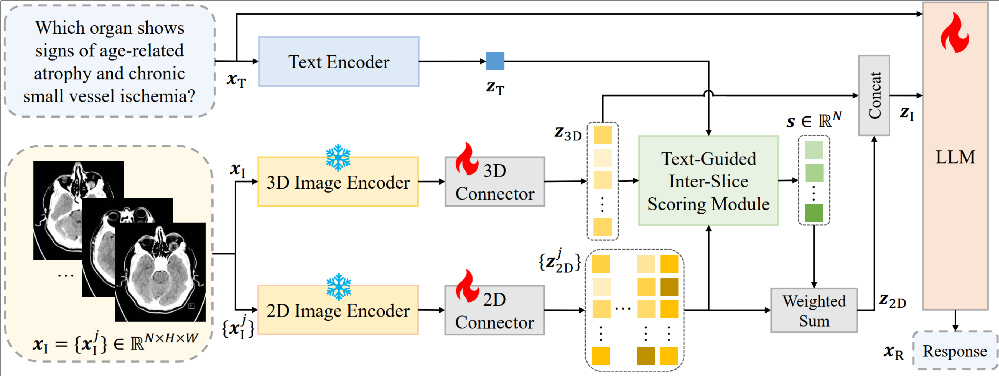

# Med-2E3: A 2D-Enhanced 3D Medical Multimodal Large Language Model (BIBM2025)

[](https://arxiv.org/abs/2411.12783) [](https://huggingface.co/shiym2000/Med-2E3-M3D) [](./LICENSE)



Inspired by clinical practice, where radiologists focus on both 3D spatial structure and 2D planar content, we propose **Med-2E3**, a 3D medical MLLM that integrates a dual 3D-2D encoder architecture. To aggregate 2D features effectively, we design a Text-Guided Inter-Slice (**TG-IS**) scoring module, which scores the attention of each 2D slice based on slice contents and task instructions. To the best of our knowledge, Med-2E3 is the **first** MLLM to integrate both 3D and 2D features for 3D medical image analysis.


## :newspaper: News
+ **[2025.10.20]**: Model weights have been released on Hugging Face.
  + [shiym2000/Med-2E3-M3D · Hugging Face](https://huggingface.co/shiym2000/Med-2E3-M3D)
+ **[2025.10.20]**: The code has been released on GitHub.
+ **[2025.10.05]**: Med-2E3 has been accepted by BIBM2025.
  + [\[2411.12783\] Med-2E3: A 2D-Enhanced 3D Medical Multimodal Large Language Model](https://arxiv.org/abs/2411.12783)


## :package: Installation
``` bash
conda create -n med2e3 python=3.10
pip3 install torch torchvision torchaudio
pip install transformers
pip install flash-attn --no-build-isolation
pip install deepspeed
pip install accelerate
pip install tensorboard
# pip install ipykernel
pip install monai
pip install evaluate
pip install nltk
pip install rouge-score
pip install bert-score
```


## :open_file_folder: Data Preparation

### 1. Pre-training

<details>
<summary>Example of pre-training annotations</summary>

``` json
[
    {
        "id": "004539375",
        "conversations": [
            {
                "from": "human",
                "value": "Render a ...\n<image>"
            },
            {
                "from": "gpt",
                "value": "select luxury furniture 3..."
            }
        ],
        "vision2d": ["00453/004539375.jpg"],
    },
    ...
]
```

</details>

### 2. Fine-tuning

<details>
<summary>Example of fine-tuning annotations</summary>

``` json
[
    {
        "id": "000000033471",
        "conversations": [
            {
                "from": "human",
                "value": "<image3d>\nWhat ..."
            },
            {
                "from": "gpt",
                "value": "The bus in the <image>..."
            },
            {
                "from": "human",
                "value": "What feature can be ..."
            },
            {
                "from": "gpt",
                "value": "The back of the bus ..."
            },
            ...
        ],
        "vision2d": [
            "coco/train2017/000000033471.jpg",
            ...
        ],
        "vision3d": [
            "ct_case/005537/Sagittal_lung_window.npy",
            ...
        ],
    },
    ...
]
```

</details>

### 3. Evaluation

<details>
<summary>Example of evaluation file</summary>

``` json
[
    {
        "id": "11",
        "conversations": [
            {
                "from": "human",
                "value": "<image3d>\nWhat is the name <image>..."
            },
            ...
        ],
        "vision2d": [
            "11/image.png",
            ...
        ],
        "vision3d": [
            "ct_case/005537/Sagittal_lung_window.npy",
            ...
        ],
    },
    ...
]
```

</details>


## :rocket: Getting Started

### 1. Train Med-2E3 from scratch

``` bash
cd path/to/Med-2E3
bash scripts/train/pretrain.sh
bash scripts/train/finetune.sh
```

### 2. Evaluation with model weights

``` bash
# 1. download weights from Hugging Face
pip install -U huggingface_hub
huggingface-cli download --resume-download shiym2000/Med-2E3-M3D --local-dir work_dirs/Med-2E3-M3D

# 2. evaluation
cd path/to/Med-2E3
bash scripts/eval/eval_m3d_cap.sh
bash scripts/eval/eval_m3d_vqa_close.sh
bash scripts/eval/eval_m3d_vqa_open.sh
```


## :book: Citation

``` bibtex
@inproceedings{shi2025med,
  title={Med-2e3: A 2d-enhanced 3d medical multimodal large language model},
  author={Shi, Yiming and Zhu, Xun and Wang, Kaiwen and Hu, Ying and Guo, Chenyi and Li, Miao and Wu, Ji},
  booktitle={2025 IEEE International Conference on Bioinformatics and Biomedicine (BIBM)},
  pages={2754--2759},
  year={2025},
  organization={IEEE}
}
```


## :heart: Acknowledgements

We would like to express our gratitude to the following resources:

+ [**MedM-VL**](https://github.com/MSIIP/MedM-VL) - A modular, LLaVA-based codebase for medical LVLMs.
